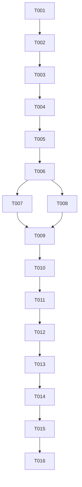

# Tasks: Phase II UI/UX Enhancement

**Feature**: `005-dark-theme-dashboard` | **Date**: 2026-01-03 | **Spec**: [spec.md](./spec.md) | **Plan**: [plan.md](./plan.md)

## Implementation Strategy

We follow a visual-first incremental approach. First, we establish the design system (Tailwind v4 tokens and theme logic). Then, we overhaul the entry point (Login/Signup) to establish the brand aesthetic. Finally, we implement the dashboard infrastructure (Sidebar/Header) and migrate the existing todo list into the new layout.

## Phase 1: Setup

- [x] T001 Initialize Tailwind v4 `@theme` variables in `frontend/src/app/globals.css`
- [x] T002 Import **Inter** and **Poppins** fonts in `frontend/src/app/layout.tsx`

## Phase 2: Foundational Theme System

- [x] T003 [P] Implement `ThemeProvider` context for `localStorage` persistence in `frontend/src/components/ThemeProvider.tsx`
- [x] T004 Implement FOUC prevention script in `frontend/src/app/layout.tsx`
- [x] T005 [P] Create premium `ThemeToggle` component in `frontend/src/components/ThemeToggle.tsx`

## Phase 3: User Story 1 - Premium Login Experience (P1)

**Goal**: Professional and clean glassmorphic auth pages.
**Independent Test**: Visit `/login` and verify glassmorphic card aesthetic.

- [x] T006 [US1] Implement glassmorphic auth card wrapper component in `frontend/src/components/AuthCard.tsx`
- [x] T007 [US1] Redesign Login page layout with ambient background in `frontend/src/app/login/page.tsx`
- [x] T008 [US1] Redesign Signup page layout in `frontend/src/app/signup/page.tsx`

## Phase 4: User Story 2 - Persistent Sidebar Navigation (P1)

**Goal**: Functional 6-item sidebar with responsive collapse.
**Independent Test**: Verify Sidebar on `/todos` with items: Dashboard, Tasks, Calendar, Reminders, Notes, Settings.

- [x] T009 [P] [US2] Implement `Sidebar` component in `frontend/src/components/Sidebar.tsx`
- [x] T010 [P] [US2] Implement `Header` component with Search and User profile in `frontend/src/components/Header.tsx`
- [x] T011 [US2] Restructure `frontend/src/app/todos/page.tsx` into a Three-Pane Layout (Sidebar | Header + Content)

## Phase 5: User Story 3 - Visual Task List (P2)

**Goal**: Minimalist task list with metadata and Inter typography.
**Independent Test**: Verify task cards show "Pendives" and action menus.

- [x] T012 [US3] Update `TodoItem` styling for minimalist black/white aesthetic in `frontend/src/components/TodoItem.tsx`
- [x] T013 [US3] Implement "Empty State" placeholder for dashboard in `frontend/src/app/todos/page.tsx`

## Phase 6: Polish & Cross-Cutting Concerns

- [x] T014 Implement dashboard responsiveness (mobile sidebar drawer)
- [x] T015 Perform visual regression check against `quickstart.md`
- [x] T016 Final performance audit (Lighthouse >= 90)

## Dependency Graph

## Parallel Execution Examples

- **UI Development**: T009 (Sidebar) and T010 (Header) can be developed in parallel before orchestration in T011.
- **Foundational**: T003 (ThemeProvider) and T005 (ThemeToggle) are independent once T001/T002 are complete.
